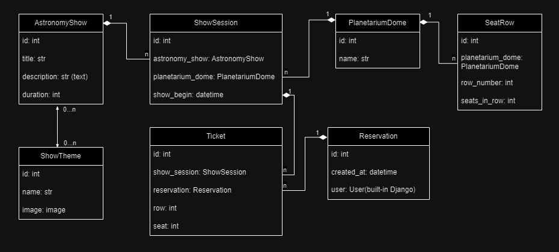

# Planetarium API

API for booking tickets to planetarium shows written in DRF.

## Table of Contents

- [Features](#features)
- [Technologies Used](#technologies-used)
- [Getting Started](#getting-started)
  - [Prerequisites](#prerequisites)
  - [Installation](#installation)
- [API Documentation](#api-documentation)
- [DB Structure](#db-structure)
- [Screenshots](#screenshots)
- [Contributing](#contributing)

## Features

- Manage astronomy shows and their details.
- Create planetarium dome instances with different amount of seats in a row.
- Schedule and manage show sessions in different planetarium domes.
- View list of next show sessions for each astronomy show.
- View number of free seats on the show session list.
- Get taken seats on the show session instance page.
- Filter astronomy shows and show sessions.
- Allow users to make reservations for show sessions.
- User authentication and authorization.
- Throttle API requests to prevent abuse.
- Add images for astronomy shows.

## Technologies Used
* Django
* Django REST framework
* Docker
* JWT Authentication
* Swagger/OpenAPI Documentation


## Getting Started

### Prerequisites
* Python (version 3.10 or higher)
* Git (optional, for cloning the repository)
* Docker

### Installation
To set up the Planetarium API project using Docker, follow these steps:
1. Install Docker:
If you don't have Docker installed, you can download and install it from the official Docker website: https://docs.docker.com/get-docker/

2. Clone the repository:

   ```bash
   git clone https://github.com/vkrasnovyd/planetarium-api.git
   cd planetarium-api
   ```

3. Edit the `.env` using the template `.env.sample`.

4. Build the Docker Image:
   ```bash
   docker build -t planetarium-api .
   ```
 
5. Build the Docker containers using Docker Compose:
    ```bash
    docker-compose build
    ```

6. Create a superuser for accessing the Django admin panel and API:
    ```bash 
    docker exec -it <container_name> bash
    python manage.py createsuperuser
    ```    
   
7. Start the Docker containers:
   ``` bash 
   docker-compose up
   ```

## API Documentation
The API documentation can be accessed at http://localhost:8000/api/doc/swagger/ which provides an interactive interface to explore and test the available API endpoints.

## DB structure


## Screenshots


## Contributing
I welcome contributions to improve the Planetarium API Service. Feel free to submit bug reports, feature requests, or pull requests to `v.krasnovyd@gmail.com`
